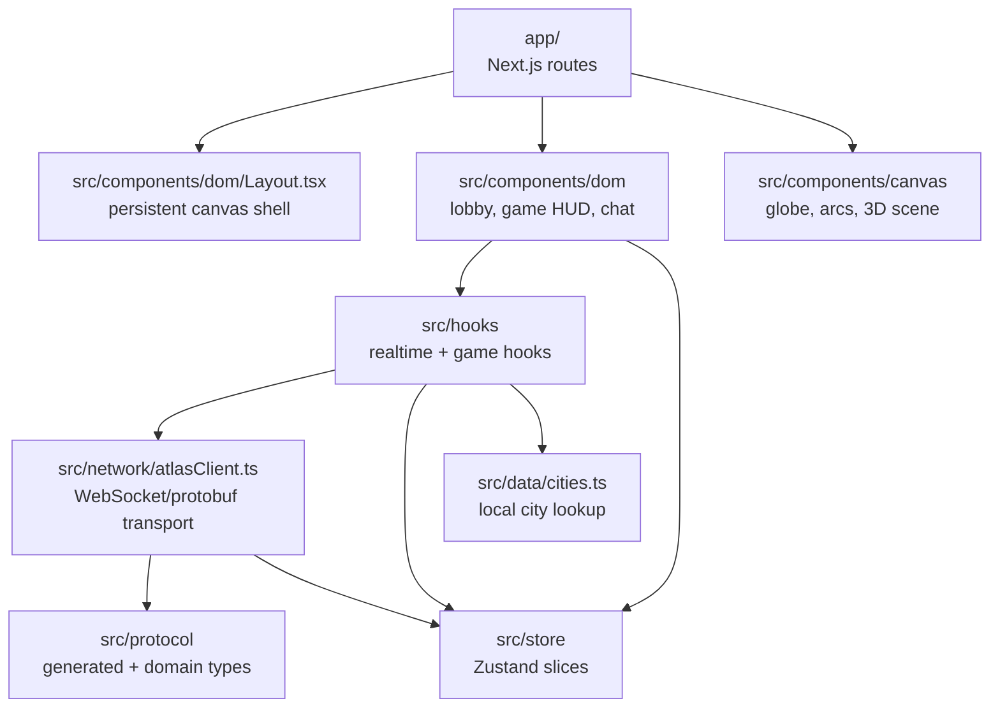
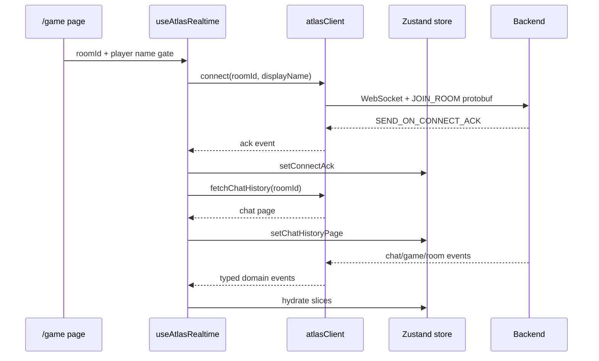
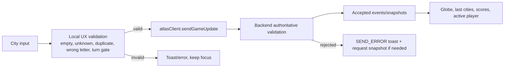
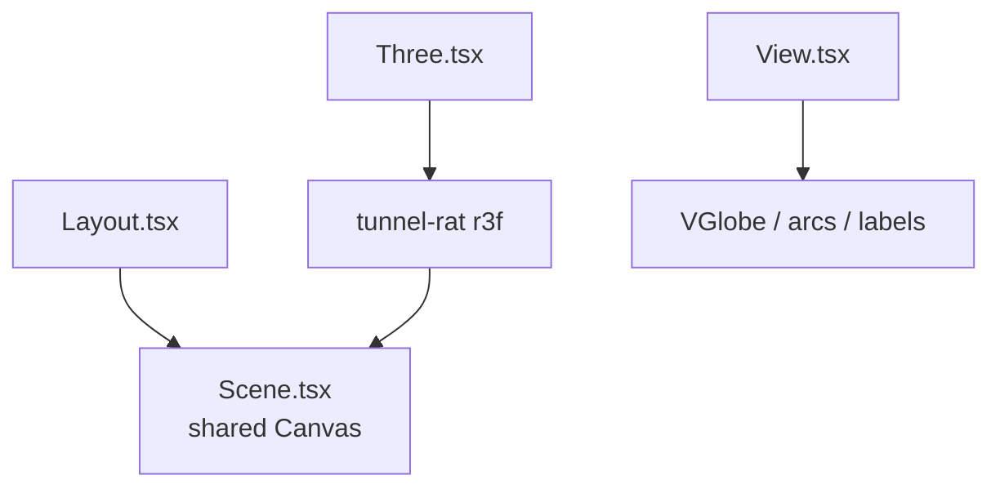

# Atlas Frontend AI Agent Guide

`atlas-mutli-game` is the Next.js/R3F frontend for Atlas. The directory name is spelled `mutli` on disk; keep that spelling in paths and commands.

## Frontend Architecture



Components should consume hooks and store selectors. Raw sockets, protobuf decoding, and backend event dispatch belong in `src/network` and protocol mapping code.

## App Structure

```text
app/                         Next.js App Router pages and global CSS
src/components/dom/          DOM overlays, lobby, game HUD, chat controls
src/components/canvas/       Persistent R3F scene, globe, arcs, labels
src/hooks/                   useAtlasRealtime, useAtlasWordGame, UI/game flows
src/network/                 atlasClient WebSocket/protobuf transport
src/protocol/generated/      generated TypeScript protobuf files
src/store/                   Zustand slices for view, room, game, realtime
src/data/                    city lookup and validation helpers
public/                      cities.json, icons, models, static assets
```

## Realtime Flow



`useAtlasRealtime(roomId, canConnect)` owns the socket lifecycle. Its connection effect should depend only on `roomId` and `canConnect`; normal chat, score, turn, or room updates must not reconnect the socket.

## Game Page Flow



The frontend never fakes accepted city history. Globe arcs, scores, current letter, and active-player highlight update from backend `BROADCAST_GAME_UPDATE`, `RESPOND_GAME_STATE`, and `BROADCAST_ROOM_UPDATE`.

## Persistent Canvas Pattern

The app uses a single persistent R3F canvas:



Add reusable 3D pieces under `src/components/canvas`. Keep browser-only canvas imports dynamic with `ssr: false` from route files.

## State Boundaries

- `ViewSlice`: theme/view state.
- `RoomSlice`: lobby room list.
- `GameSlice`: Atlas game UI state and accepted city history.
- `RealtimeSlice`: connection state, player id/name, players, chat, snapshots, errors, unread count.

Prefer narrowly selected Zustand state in components to avoid broad rerenders. Keep transport state out of presentational components.

## Styling And UI Conventions

Tailwind is the main styling tool. Reuse global classes from `app/global.css` where possible. Keep HUD elements readable over the globe and preserve `pointer-events-none` on noninteractive overlays with `pointer-events-auto` on controls.

Use existing UI helpers such as `Tooltip.tsx` and `Toaster.tsx`. Game controls should remain compact: chat bottom-right, share bottom-left, turn status above input, and players in side columns.

## Protocol And Generated Code

TypeScript protobufs are generated from backend `.proto` contracts:

```powershell
pnpm proto:gen
```

Generated files live under `src/protocol/generated` and should not be manually edited. Domain-facing types belong in `src/protocol/types.ts`.

## Commands

```powershell
pnpm install
pnpm proto:gen
pnpm dev
pnpm typecheck
pnpm lint
pnpm format:check
pnpm build
```

Run the Go backend before manual WebSocket verification.

## Common Change Patterns

For new realtime events: update protobufs, regenerate, decode in `atlasClient`, map to domain types, hydrate Zustand in `useAtlasRealtime`, then render through components.

For new game UI: keep generic realtime plumbing reusable, add a game-specific hook, validate only for UX locally, and wait for backend accepted events before mutating authoritative history.
