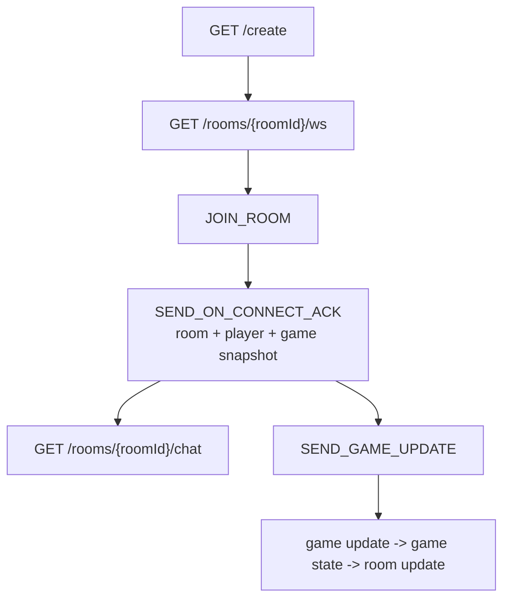
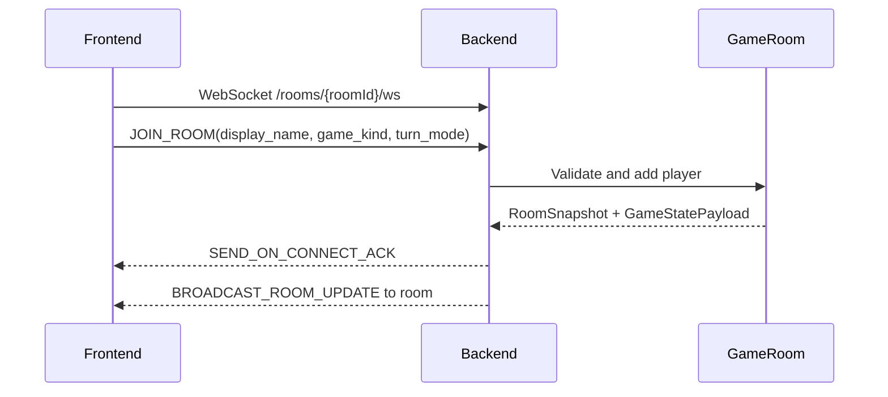
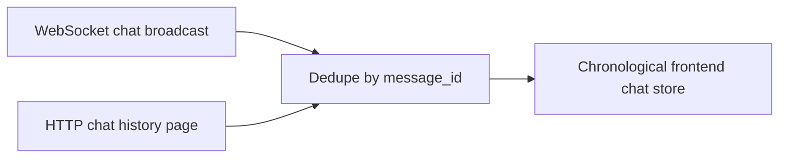
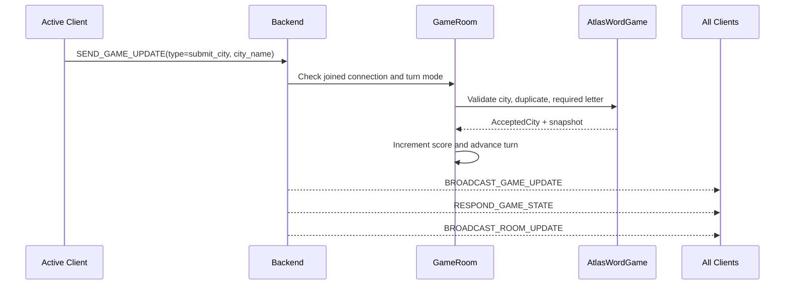
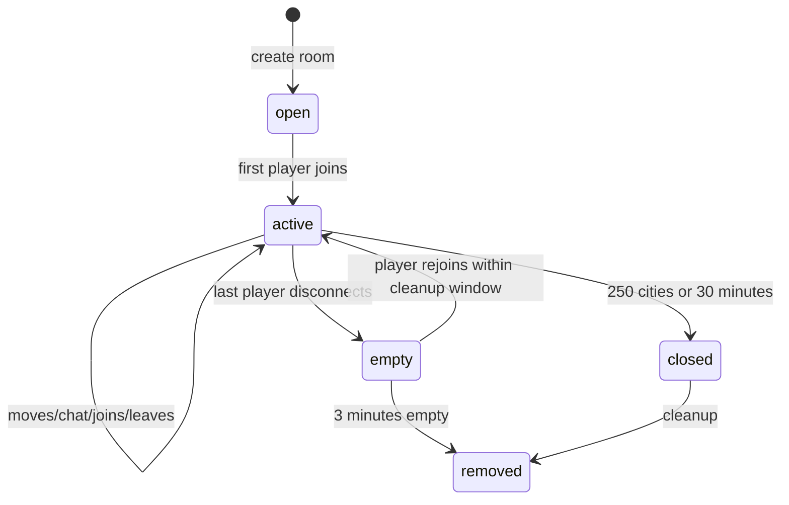

# Backend Contract For Frontend Multiplayer

This document records the backend contract the frontend expects for Atlas multiplayer.

## Current Contract Summary

- WebSockets use `GET /rooms/{roomId}/ws`.
- The first client message must be protobuf `JOIN_ROOM` with `display_name`, `game_kind`, and optional `turn_mode`.
- The ACK includes `roomId`, `playerId`, `gameKind`, `turnMode`, room/player/score metadata, active turn, and current game snapshot.
- Chat messages are room-scoped. Stored and HTTP-returned chat messages do not include `roomId`.
- Atlas game actions are backend-authoritative. The frontend may pre-validate for UX, but accepted city history and scores update only from backend events/snapshots.
- Default mode is `strict-turns`; `free-for-all` remains supported through `turn_mode`.

## Current Routes

- `GET /create?gameKind=atlas-word&turnMode=strict-turns`
  - Creates an in-memory room.
  - `turnMode` is optional and defaults to `strict-turns`; `free-for-all` is also supported.
  - Returns `{ roomId, gameKind, status, turnMode }`.
- `GET /rooms/{roomId}/ws`
  - Plain WebSocket using binary protobuf frames.
  - The first client message must be `JOIN_ROOM`.
- `GET /rooms/{roomId}/chat?limit=50&before=<messageId>`
  - Returns latest-first chat history.
  - Response shape: `{ messages, nextCursor }`.

## WebSocket Join And Player Identity

- Client sends `JOIN_ROOM` with `display_name`, `game_kind`, and optional `turn_mode`.
- Server validates name, room existence, room status, capacity, game kind, and turn mode before activating the player.
- Server sends `SEND_ON_CONNECT_ACK` with:
  - `room_id`, `player_id`, `game_kind`, `turn_mode`
  - `RoomSnapshot`: status, max players, timestamps, turn mode, current players
  - `GameStatePayload`: current Atlas snapshot and current turn metadata
- Player snapshots include `player_id`, `name`, `hearts`, `score`, `connected`, `joined_at`, and `last_seen_at`.
- Server broadcasts `BROADCAST_ROOM_UPDATE` when players join, leave, or score changes.

## Chat

- Client chat payload only needs `content`; backend derives sender identity from the connection.
- Server trims and validates chat content, rejects empty messages, and enforces a 280-character limit.
- Live chat broadcasts include `message_id`, `sender_id`, `sender_name`, `content`, and `created_at`.
- Chat history messages are room-scoped by endpoint and do not include `roomId` per message.
- History pagination is HTTP latest-first; frontend dedupes history and live messages by `message_id`.

## Atlas Word Game

- Frontend may do local advisory validation, but backend is authoritative.
- Client sends `SEND_GAME_UPDATE` with:
  - `type = "submit_city"`
  - `game_kind = "atlas-word"`
  - `city_name`
- Backend validates city existence, current starting letter, and room-level duplicate cities.
- In `strict-turns` mode, backend rejects inactive-player moves with `not_your_turn`.
- In `free-for-all` mode, any connected player may submit a valid city.
- Accepted cities include only `city_hash`, `name`, submitter identity, and timestamp on the wire.
- Each accepted city increments the submitting player's score by 1.
- Accepted updates broadcast `BROADCAST_GAME_UPDATE` with `type = "city_accepted"` and `accepted_city`.
- Backend then broadcasts the updated `RESPOND_GAME_STATE` snapshot, followed by `BROADCAST_ROOM_UPDATE` with updated player scores.
- `GameStatePayload` includes `current_turn_player_id`, `current_turn_player_name`, and `turn_index`.
- Game ends when 250 cities are accepted or 30 minutes have elapsed from room/game start.

## Accepted Move Event Ordering

After an accepted move, clients expect this order:

1. `BROADCAST_GAME_UPDATE`
2. `RESPOND_GAME_STATE`
3. `BROADCAST_ROOM_UPDATE`

Rejected moves should emit a typed `SEND_ERROR` and must not mutate score, turn, or game history.

## Room Lifecycle

- Rooms are in-memory for this pass.
- Empty rooms are cleaned up after 3 minutes with no connected players.
- Rooms are removed when the game expires or ends.
- Closed/expired/missing rooms return typed server errors over WebSocket or HTTP status errors for history routes.

## Remaining Production Follow-Ups

- Add protocol versioning or negotiation.
- Add heartbeat/ping and frontend reconnect policy.
- Decide whether room creation needs a visible frontend selector for `strict-turns` vs `free-for-all`.
- Decide whether chat/game history should survive process restarts.
- Add auth/rate limits before exposing rooms publicly.
- Add a game registry with custom validators, score policies, turn policies, snapshots, and completion rules for future games.
