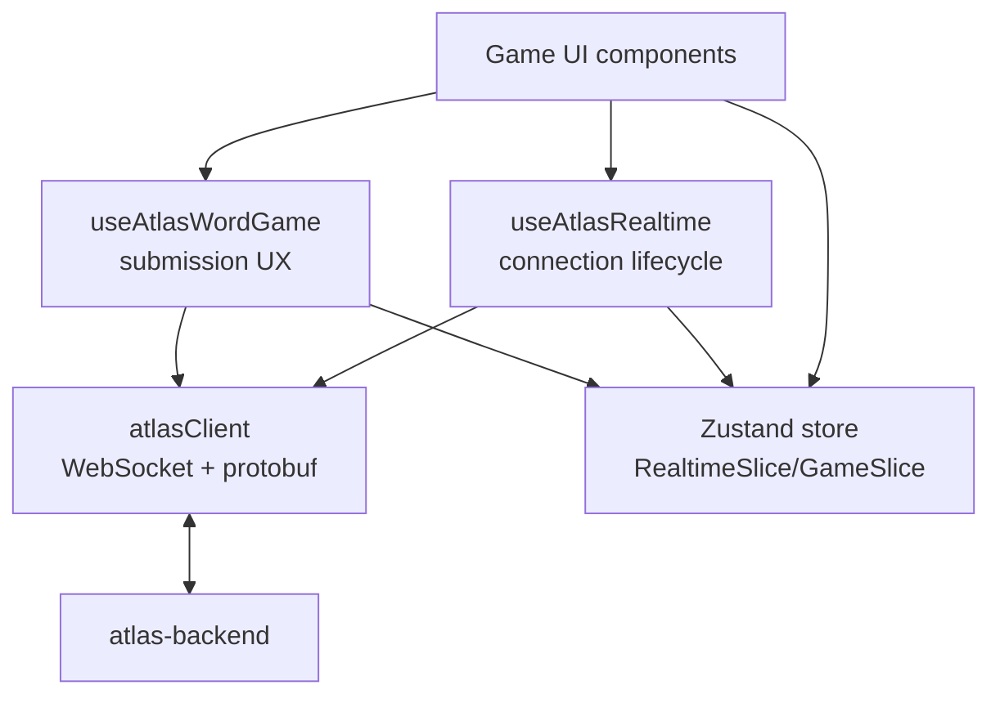
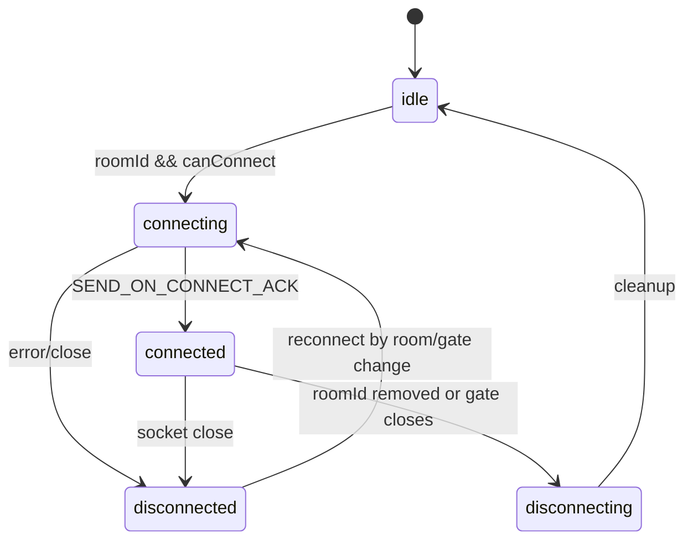
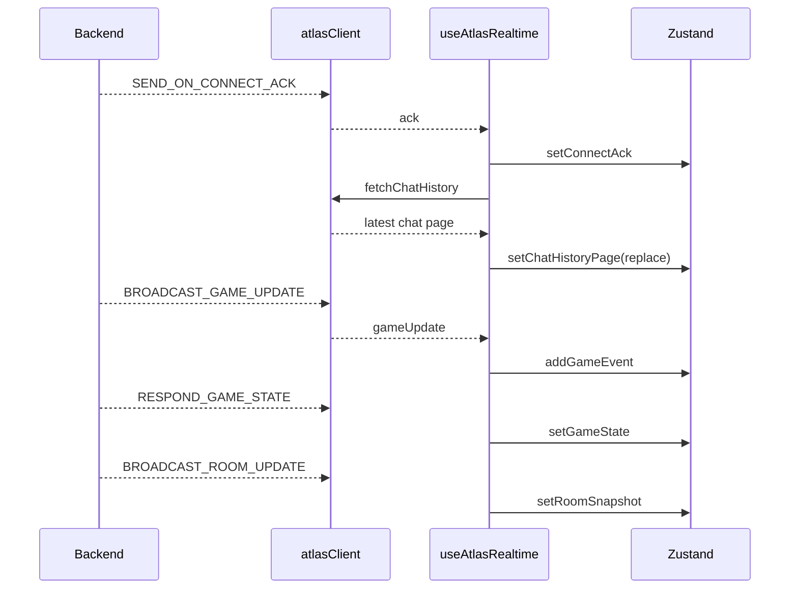
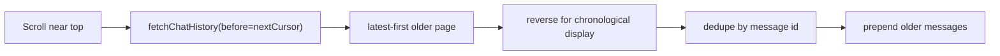
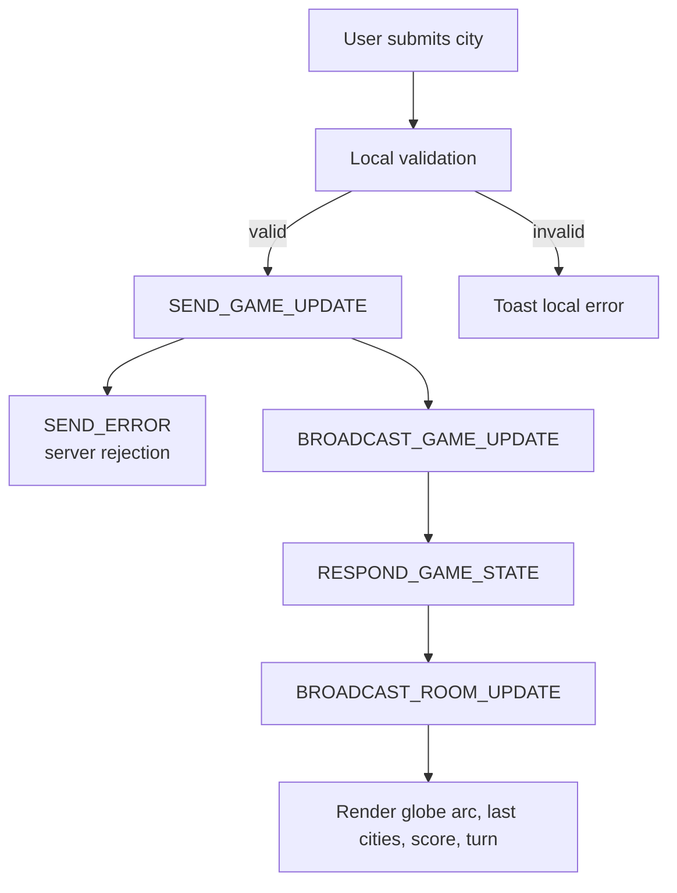

# Realtime Architecture

The frontend treats `src/network/atlasClient.ts` as the only low-level WebSocket/protobuf transport. Components use hooks and Zustand state, never the raw socket.

## Module Boundary

## WebSocket Lifecycle

`useAtlasRealtime(roomId, canConnect)` owns the connection. Its connection effect depends only on `roomId` and `canConnect`, so chat messages, scores, turns, errors, and room snapshots do not reconnect the socket.

Event handlers read the latest Zustand actions through `useStore.getState()`. This keeps the handlers stable for the lifetime of one connection while still applying updates to current state.

Missing-turn repair is a separate effect. It can request `REQUEST_GAME_STATE`, but it must never reconnect the socket.

## Hydration Order

On ACK:

1. Store room id, player id, game kind, turn mode, players, scores, and game snapshot.
2. Fetch latest chat history over HTTP.
3. Replace chat history with the latest page.

On accepted backend moves:

1. `BROADCAST_GAME_UPDATE` adds the accepted city event.
2. `RESPOND_GAME_STATE` replaces authoritative game history and turn metadata.
3. `BROADCAST_ROOM_UPDATE` updates players, scores, and active-player highlight.

## Chat Pagination

Chat history is loaded latest-first from `/api/rooms/{roomId}/chat`. The store reverses pages into chronological display order, dedupes by message id, and prepends older pages on scroll-up.

Live chat messages use the same store path and are deduped by id, so HTTP history and WebSocket broadcasts can overlap safely.

## Atlas City Flow

The hook performs fast local checks for empty, unknown, duplicate, wrong-continuation, disconnected, assigning-turn, and not-your-turn cases. The backend remains authoritative: the globe/history updates only after backend accepted updates or snapshots.

## Future Games

New games should reuse the realtime layer by adding:

- A game kind.
- Domain mapping between protobuf payloads and frontend state.
- A game hook that validates local UX constraints and sends typed actions through `atlasClient`.
- UI components that consume store selectors instead of protobuf messages directly.
